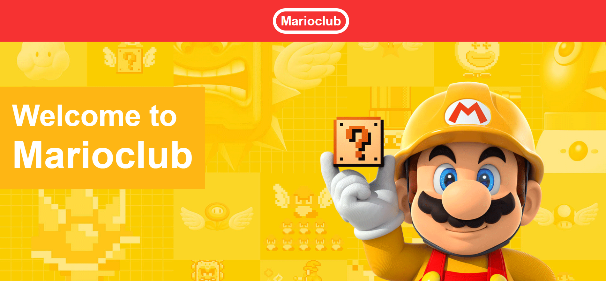

# MarioClub-HTML5 & CSS Practice Project
This is a mini website I designed using HTML5 and CSS for learn basic things in html5 and various styles of CSS.

# Website Demonstartion
[https://drive.google.com/drive/u/0/folders/18UEq-plaGjheWkudtf2PqrmO_yfCV39f](https://dms.uom.lk/s/jfCL7Ke7RDatq3q)

# Final User Interfaces

